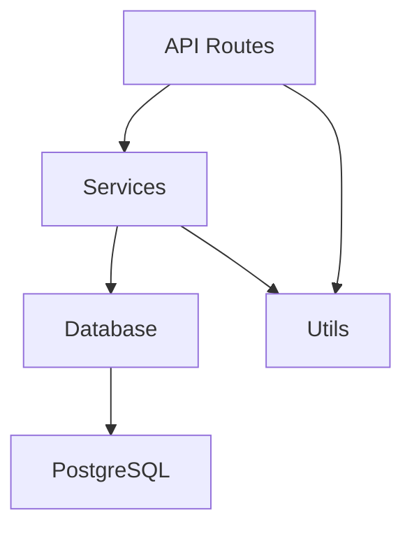

# CODEBASE_INDEX.md

> **维护说明**:
>
> - 创建者：`dev-engineer` (项目启动时)
> - 审核者：`architect` (确认与架构一致)
> - 更新时机：新增文件/API 变更/数据模型修改时
> - 所有智能体可读，用于理解代码上下文

---

## 📁 文件树

```
src/
├── auth/              # 认证模块
│   ├── login.ts       # 登录 API (POST /api/auth/login)
│   ├── register.ts    # 注册 API (POST /api/auth/register)
│   └── jwt.ts         # JWT 工具函数
├── db/                # 数据库层
│   ├── user.ts        # User 模型 + DDL
│   ├── message.ts     # Message 模型
│   └── index.ts       # 数据库连接
├── api/               # API 路由
│   └── v1/            # API v1
│       ├── auth.ts    # 认证路由
│       └── user.ts    # 用户路由
├── services/          # 业务逻辑层
│   └── auth.service.ts
└── utils/             # 工具函数
    └── logger.ts
```

---

## 🌐 API 路由表

| Method | Path               | Handler            | Auth Required | Description  |
| ------ | ------------------ | ------------------ | ------------- | ------------ |
| POST   | /api/auth/login    | `auth/login.ts`    | ❌            | 用户登录     |
| POST   | /api/auth/register | `auth/register.ts` | ❌            | 用户注册     |
| POST   | /api/auth/logout   | `auth/logout.ts`   | ✅            | 用户登出     |
| GET    | /api/user/:id      | `user/get.ts`      | ✅            | 获取用户信息 |
| PUT    | /api/user/:id      | `user/update.ts`   | ✅            | 更新用户信息 |
| GET    | /api/messages      | `message/list.ts`  | ✅            | 获取消息列表 |
| POST   | /api/messages      | `message/send.ts`  | ✅            | 发送消息     |

---

## 🗄️ 数据模型

### User

```typescript
interface User {
  id: string; // UUID, primary key
  email: string; // unique, not null, indexed
  passwordHash: string; // bcrypt, not null, min length 60
  displayName: string; // nullable, max 50 chars
  avatarUrl: string; // nullable, URL format
  createdAt: Date; // auto-generated, not null
  updatedAt: Date; // auto-updated, not null
  lastLoginAt: Date; // nullable, updated on login
}
```

**DDL**:

```sql
CREATE TABLE users (
  id UUID PRIMARY KEY DEFAULT gen_random_uuid(),
  email VARCHAR(255) UNIQUE NOT NULL,
  password_hash VARCHAR(255) NOT NULL,
  display_name VARCHAR(50),
  avatar_url TEXT,
  created_at TIMESTAMP WITH TIME ZONE DEFAULT NOW(),
  updated_at TIMESTAMP WITH TIME ZONE DEFAULT NOW(),
  last_login_at TIMESTAMP WITH TIME ZONE
);

CREATE INDEX idx_users_email ON users(email);
CREATE INDEX idx_users_created_at ON users(created_at);
```

### Message

```typescript
interface Message {
  id: string; // UUID, primary key
  senderId: string; // UUID, foreign key → users.id
  receiverId: string; // UUID, foreign key → users.id
  content: string; // not null, max 10000 chars
  isRead: boolean; // default false
  createdAt: Date; // auto-generated, not null
}
```

**DDL**:

```sql
CREATE TABLE messages (
  id UUID PRIMARY KEY DEFAULT gen_random_uuid(),
  sender_id UUID NOT NULL REFERENCES users(id) ON DELETE CASCADE,
  receiver_id UUID NOT NULL REFERENCES users(id) ON DELETE CASCADE,
  content TEXT NOT NULL,
  is_read BOOLEAN DEFAULT FALSE,
  created_at TIMESTAMP WITH TIME ZONE DEFAULT NOW()
);

CREATE INDEX idx_messages_sender ON messages(sender_id);
CREATE INDEX idx_messages_receiver ON messages(receiver_id);
CREATE INDEX idx_messages_created_at ON messages(created_at);
```

---

## 🔑 关键函数签名

### Auth Module

```typescript
// 用户登录
// @param email - 用户邮箱
// @param password - 明文密码
// @returns Promise<{ token: string, expiresIn: number }>
// @throws AuthError('USER_NOT_FOUND' | 'INVALID_PASSWORD')
function login(email: string, password: string): Promise<LoginResponse>;

// 生成 JWT
// @param user - 用户对象
// @returns JWT token string
function generateJWT(user: User): string;

// 验证 JWT
// @param token - JWT token
// @returns 解析后的 payload (包含 userId)
// @throws AuthError('TOKEN_EXPIRED' | 'TOKEN_INVALID')
function verifyJWT(token: string): JWTPayload;
```

### Database Module

```typescript
// 通过邮箱查找用户
// @param email - 用户邮箱
// @returns Promise<User | null>
function findUserByEmail(email: string): Promise<User | null>;

// 通过 ID 查找用户
// @param id - 用户 UUID
// @returns Promise<User | null>
function findUserById(id: string): Promise<User | null>;

// 创建新用户
// @param data - 用户数据 (email, passwordHash, displayName?)
// @returns Promise<User>
function createUser(data: CreateUserInput): Promise<User>;
```

---

## 📦 依赖关系



---

## 📝 更新日志

| 日期       | 智能体       | 变更内容 |
| ---------- | ------------ | -------- |
| 2026-03-20 | dev-engineer | 初始创建 |

---

**下次更新**: 当新增文件/API/数据模型时，请立即更新此索引
