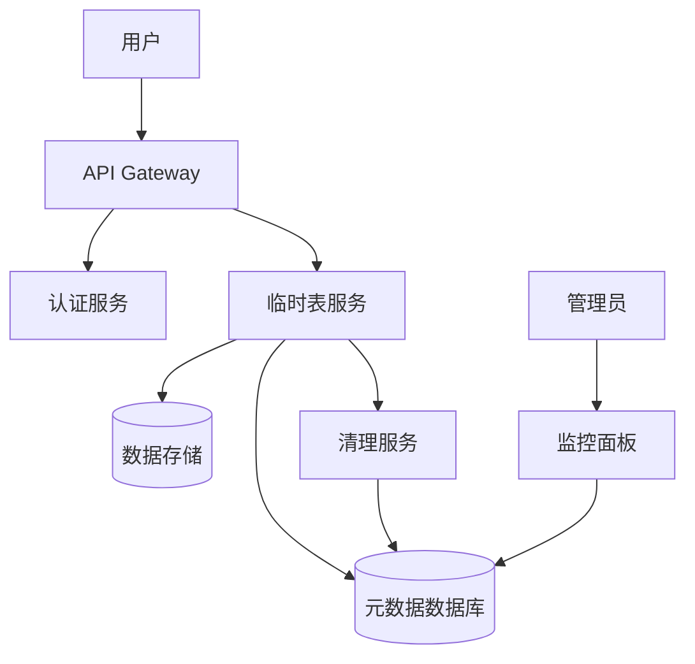
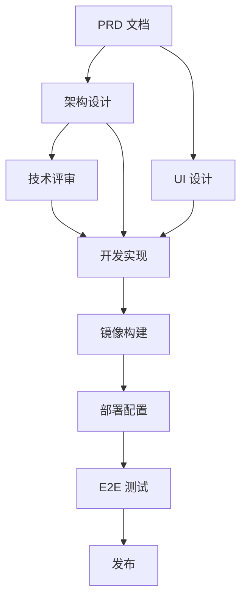

# ChatBI 临时表隔离方案 - 综合协调方案

> **文档状态**: 综合协调方案 v1.0 **创建时间**: 2026-03-20 **编排器**: ai-orchestrator **参与智能体**: architect,
> product-manager, tech-leader, dev-engineer, devops-engineer, qa-engineer, ui-ux-designer, project-manager

---

## 📋 一、方案背景与目标

### 1.1 业务背景

ChatBI 系统中，用户在进行数据分析时会产生大量临时表（临时查询结果、中间计算表、用户自定义视图等）。当前缺乏有效的隔离机制，导致：

- 不同用户/会话的临时表相互干扰
- 资源竞争和性能问题
- 数据安全隐患
- 临时表生命周期管理混乱

### 1.2 方案目标

建立完善的临时表隔离机制，实现：

- **用户级隔离**: 不同用户的临时表完全隔离
- **会话级隔离**: 同一用户不同会话的临时表隔离
- **资源配额**: 每个用户/会话的临时表资源限制
- **生命周期管理**: 自动清理过期临时表
- **安全合规**: 防止跨用户数据访问

---

## 🏗️ 二、各智能体方案汇总

### 2.1 Product Manager - 产品方案

#### 核心需求

| 需求 ID | 需求描述                 | 优先级 | 验收标准                             |
| ------- | ------------------------ | ------ | ------------------------------------ |
| PM-01   | 用户创建临时表时自动隔离 | P0     | 用户 A 无法看到用户 B 的临时表       |
| PM-02   | 会话结束时自动清理临时表 | P0     | 会话断开 30 分钟后临时表自动删除     |
| PM-03   | 临时表配额管理           | P1     | 每用户最多 50 个临时表，每表最大 1GB |
| PM-04   | 临时表使用监控           | P1     | 用户可查看自己的临时表使用量         |
| PM-05   | 管理员全局视图           | P2     | 管理员可查看所有临时表状态           |

#### 用户故事

```gherkin
场景：用户创建临时表
  给定 用户已登录并拥有有效会话
  当 用户执行 CREATE TEMPORARY TABLE 语句
  那么 系统自动为该表添加用户隔离标识
  并且 其他用户无法查询该表

场景：会话超时清理
  给定 用户会话已断开超过 30 分钟
  当 系统执行定时清理任务
  那么 该会话的所有临时表被自动删除
  并且 释放占用的存储资源
```

#### WorkPackages 输出

| Agent           | Input         | Output               | Acceptance          |
| --------------- | ------------- | -------------------- | ------------------- |
| ui-ux-designer  | P0 功能列表   | DesignDeliverables   | 设计覆盖所有 AC     |
| architect       | PRD/设计草稿  | ArchitecturePackages | 契约字段级可实现    |
| dev-engineer    | 架构/设计     | DevDeliverables      | E2E 可通行，AC 覆盖 |
| qa-engineer     | PRD AC/交付物 | QADeliverables       | E2E 通过，AC 覆盖   |
| devops-engineer | 架构拓扑      | DevOpsDeliverables   | 可部署，监控就绪    |

---

### 2.2 Architect - 架构设计

#### 系统上下文



#### 数据模型设计

```sql
-- 临时表元数据表
CREATE TABLE temporary_tables (
    id              VARCHAR(64) PRIMARY KEY,
    table_name      VARCHAR(256) NOT NULL,
    user_id         VARCHAR(64) NOT NULL,
    session_id      VARCHAR(64) NOT NULL,
    schema_name     VARCHAR(128),
    created_at      TIMESTAMP DEFAULT CURRENT_TIMESTAMP,
    expires_at      TIMESTAMP NOT NULL,
    size_bytes      BIGINT DEFAULT 0,
    row_count       BIGINT DEFAULT 0,
    status          VARCHAR(32) DEFAULT 'active',
    isolation_level VARCHAR(32) DEFAULT 'user_session',
    INDEX idx_user_session (user_id, session_id),
    INDEX idx_expires (expires_at),
    INDEX idx_status (status)
);

-- 用户配额表
CREATE TABLE user_quotas (
    user_id         VARCHAR(64) PRIMARY KEY,
    max_tables      INT DEFAULT 50,
    max_size_bytes  BIGINT DEFAULT 1073741824,
    current_tables  INT DEFAULT 0,
    current_size    BIGINT DEFAULT 0,
    updated_at      TIMESTAMP DEFAULT CURRENT_TIMESTAMP
);

-- 会话表
CREATE TABLE user_sessions (
    session_id      VARCHAR(64) PRIMARY KEY,
    user_id         VARCHAR(64) NOT NULL,
    created_at      TIMESTAMP DEFAULT CURRENT_TIMESTAMP,
    last_active     TIMESTAMP DEFAULT CURRENT_TIMESTAMP,
    status          VARCHAR(32) DEFAULT 'active',
    INDEX idx_user (user_id),
    INDEX idx_status (status)
);
```

#### API 契约

```yaml
# 创建临时表
POST /api/v1/temp-tables
Request:
  {
    "table_name": "string",
    "schema": "string",
    "ttl_minutes": 30
  }
Response:
  {
    "table_id": "string",
    "full_name": "temp_{user_id}_{session_id}_{table_name}",
    "expires_at": "timestamp"
  }

# 查询临时表列表
GET /api/v1/temp-tables?user_id={user_id}&session_id={session_id}
Response:
  {
    "tables": [
      {
        "table_id": "string",
        "table_name": "string",
        "size_bytes": "number",
        "row_count": "number",
        "created_at": "timestamp",
        "expires_at": "timestamp"
      }
    ],
    "quota": {
      "max_tables": 50,
      "current_tables": 10,
      "max_size_bytes": 1073741824,
      "current_size_bytes": 524288000
    }
  }

# 删除临时表
DELETE /api/v1/temp-tables/{table_id}
Response:
  {
    "success": true,
    "deleted_at": "timestamp"
  }
```

#### 架构 Packages

| Agent           | Task           | Input              | Output            | Acceptance            | Dependencies   |
| --------------- | -------------- | ------------------ | ----------------- | --------------------- | -------------- |
| dev-engineer    | 临时表服务实现 | API 契约，数据模型 | 可运行的 API 服务 | 所有 API 通过单元测试 | MetaDB 就绪    |
| dev-engineer    | 清理服务实现   | 清理策略           | 定时清理任务      | 可正确删除过期表      | 临时表服务就绪 |
| qa-engineer     | E2E 测试       | PRD AC, API 契约   | 测试脚本          | E2E 通过率 100%       | 服务部署完成   |
| devops-engineer | 部署配置       | 架构拓扑           | Docker/Helm 配置  | 可一键部署            | 镜像构建完成   |

---

### 2.3 Tech Leader - 技术规划

#### 技术选型

| 组件         | 选项                         | 推荐             | 理由                  |
| ------------ | ---------------------------- | ---------------- | --------------------- |
| 元数据存储   | MySQL / PostgreSQL / MongoDB | PostgreSQL       | JSON 支持好，事务可靠 |
| 临时数据存储 | Redis / 内存数据库 / 临时表  | 数据库原生临时表 | 与现有系统集成好      |
| 会话管理     | Redis Session / JWT          | JWT + Redis      | 无状态 + 快速失效     |
| 清理调度     | Cron / Kubernetes CronJob    | K8s CronJob      | 云原生，可扩展        |

#### 技术风险

| 风险                     | 影响 | 概率 | 应对措施              |
| ------------------------ | ---- | ---- | --------------------- |
| 清理任务失败导致资源泄漏 | 高   | 中   | 双重清理机制 + 告警   |
| 高并发下元数据锁竞争     | 中   | 中   | 分区表 + 乐观锁       |
| 用户配额超限绕过         | 高   | 低   | 创建前校验 + 事务保护 |
| 会话状态不一致           | 中   | 低   | 心跳机制 + 超时兜底   |

#### TechLeadDeliverables

| 交付物类型 | 对象           | 结论             | 验收                 | 下游动作             |
| ---------- | -------------- | ---------------- | -------------------- | -------------------- |
| 架构审查   | 临时表隔离设计 | 通过 (有条件)    | 补充清理任务 Runbook | dev-engineer 实现    |
| 技术决策   | 技术选型       | 已确定           | 见技术选型表         | devops-engineer 配置 |
| 集成协调   | 与现有系统集成 | 需先完成认证对接 | 认证服务优先         | dev-engineer 排期    |

---

### 2.4 Dev Engineer - 代码实现

#### 实现计划

```
Phase 1: 核心服务 (预计 4 小时)
├── 临时表元数据服务
│   ├── createTempTable()
│   ├── getTempTables()
│   ├── deleteTempTable()
│   └── checkQuota()
├── 会话管理服务
│   ├── createSession()
│   ├── refreshSession()
│   └── invalidateSession()
└── 配额管理服务
    ├── getUserQuota()
    ├── updateQuotaUsage()
    └── resetQuota()

Phase 2: 清理服务 (预计 2 小时)
├── 定时清理任务
│   ├── scanExpiredTables()
│   ├── deleteExpiredTable()
│   └── cleanupOrphanedTables()
└── 手动清理接口
    └── forceCleanup()

Phase 3: 集成与自验证 (预计 2 小时)
├── API 集成测试
├── 前端联调
└── 性能测试
```

#### DevDeliverables

| API/组件/页面           | PRD AC       | Input                  | Output           | Acceptance          | Dependencies |
| ----------------------- | ------------ | ---------------------- | ---------------- | ------------------- | ------------ |
| POST /temp-tables       | PM-01        | 用户 ID, 会话 ID, 表名 | 临时表 ID, 全名  | 表带隔离标识        | 认证服务     |
| GET /temp-tables        | PM-01, PM-04 | 用户 ID, 会话 ID       | 表列表，配额信息 | 仅返回用户自己的表  | 元数据服务   |
| DELETE /temp-tables/:id | PM-01        | 表 ID                  | 删除结果         | 仅可删除自己的表    | 元数据服务   |
| Cleaner Service         | PM-02        | -                      | 清理日志         | 30 分钟过期表被删除 | 元数据服务   |
| Quota Service           | PM-03        | 用户 ID                | 配额状态         | 超限时拒绝创建      | 元数据服务   |

---

### 2.5 DevOps Engineer - 部署方案

#### 部署拓扑

```yaml
# Docker Compose (开发环境)
version: "3.8"
services:
  chatbi-api:
    image: chatbi-api:latest
    ports:
      - "8080:8080"
    environment:
      - DB_HOST=postgres
      - REDIS_HOST=redis
      - CLEANER_INTERVAL=300
    depends_on:
      - postgres
      - redis

  temp-table-cleaner:
    image: chatbi-api:latest
    command: ["npm", "run", "cleaner"]
    environment:
      - DB_HOST=postgres
      - CLEANUP_BATCH_SIZE=100
    depends_on:
      - postgres

  postgres:
    image: postgres:15
    volumes:
      - pgdata:/var/lib/postgresql/data
    environment:
      - POSTGRES_DB=chatbi

  redis:
    image: redis:7
    volumes:
      - redisdata:/data

volumes:
  pgdata:
  redisdata:
```

#### Kubernetes 配置 (生产环境)

```yaml
# CronJob for cleanup
apiVersion: batch/v1
kind: CronJob
metadata:
  name: temp-table-cleaner
spec:
  schedule: "*/5 * * * *" # 每 5 分钟执行
  jobTemplate:
    spec:
      template:
        spec:
          containers:
            - name: cleaner
              image: chatbi-api:latest
              command: ["npm", "run", "cleaner"]
              env:
                - name: DB_HOST
                  valueFrom:
                    secretKeyRef:
                      name: chatbi-db
                      key: host
          restartPolicy: OnFailure
```

#### DevOpsDeliverables

| 交付物类型     | 架构/NFR | Input          | Output             | Acceptance        | Dependencies    |
| -------------- | -------- | -------------- | ------------------ | ----------------- | --------------- |
| Docker Compose | 开发环境 | 服务配置       | docker-compose.yml | 一键启动所有服务  | 镜像构建完成    |
| Helm Chart     | 生产环境 | K8s 配置       | chatbi-chart/      | helm install 成功 | 镜像推送完成    |
| CI/CD Pipeline | 持续集成 | GitHub Actions | .github/workflows/ | 自动构建部署      | 仓库配置完成    |
| 监控告警       | NFR      | Prometheus     | 告警规则           | 清理失败告警      | Prometheus 部署 |

---

### 2.6 QA Engineer - 测试方案

#### 测试策略

```
测试层级:
├── E2E 测试 (优先)
│   ├── 用户创建临时表流程
│   ├── 跨用户隔离验证
│   ├── 会话超时清理验证
│   └── 配额限制验证
├── 集成测试
│   ├── API 契约测试
│   ├── 数据库事务测试
│   └── 清理服务集成测试
├── 单元测试
│   ├── 配额计算逻辑
│   ├── 隔离标识生成
│   └── 过期时间计算
└── 性能测试
    ├── 并发创建临时表
    └── 大量临时表清理性能
```

#### E2E 测试用例 (Playwright)

```typescript
// 测试：跨用户隔离
test("用户无法访问其他用户的临时表", async ({ page }) => {
  // 用户 A 创建临时表
  await loginUserA(page);
  await createTempTable(page, "table_a");

  // 用户 B 尝试访问
  await loginUserB(page);
  const tables = await getTempTables(page);

  // 验证用户 B 看不到用户 A 的表
  expect(tables).not.toContain("table_a");
});

// 测试：会话超时清理
test("会话超时后临时表自动清理", async ({ page }) => {
  // 创建临时表
  await loginUser(page);
  await createTempTable(page, "test_table");

  // 等待 30 分钟 (测试环境可缩短)
  await page.waitForTimeout(30 * 60 * 1000);

  // 验证表已被清理
  const tables = await getTempTables(page);
  expect(tables).not.toContain("test_table");
});
```

#### QADeliverables

| 测试类型     | PRD AC | Input        | Output       | Acceptance      | Dependencies |
| ------------ | ------ | ------------ | ------------ | --------------- | ------------ |
| E2E-隔离验证 | PM-01  | 两个用户账号 | 隔离测试结果 | 100% 隔离       | 服务部署完成 |
| E2E-清理验证 | PM-02  | 测试会话     | 清理验证结果 | 30 分钟自动删除 | 清理服务运行 |
| E2E-配额验证 | PM-03  | 测试用户     | 配额测试结果 | 超限拒绝创建    | 配额服务就绪 |
| 性能测试     | NFR    | 并发请求     | 性能报告     | P99 < 100ms     | 压测环境就绪 |

---

### 2.7 UI/UX Designer - UX 优化

#### 设计 Token

```css
:root {
  /* 颜色 */
  --color-primary: #1890ff;
  --color-success: #52c41a;
  --color-warning: #faad14;
  --color-error: #f5222d;

  /* 间距 */
  --spacing-xs: 4px;
  --spacing-sm: 8px;
  --spacing-md: 16px;
  --spacing-lg: 24px;

  /* 圆角 */
  --radius-sm: 4px;
  --radius-md: 8px;
  --radius-lg: 12px;
}
```

#### 页面布局

```
临时表管理页面
├── 配额使用卡片
│   ├── 表数量：10/50
│   └── 存储空间：500MB/1GB
├── 临时表列表
│   ├── 表名
│   ├── 创建时间
│   ├── 过期时间
│   ├── 大小
│   └── 操作 (删除/刷新)
└── 创建临时表按钮
```

#### DesignDeliverables

| 组件/页面  | PRD AC       | Input      | Output     | Acceptance   | Dependencies |
| ---------- | ------------ | ---------- | ---------- | ------------ | ------------ |
| 配额卡片   | PM-04        | 配额数据   | 可视化组件 | 实时更新     | API 就绪     |
| 临时表列表 | PM-01, PM-04 | 表列表数据 | 表格组件   | 仅显示用户表 | API 就绪     |
| 创建表单   | PM-01        | -          | 表单组件   | 提交后创建表 | API 就绪     |
| 管理员视图 | PM-05        | 全局数据   | 管理面板   | 显示所有表   | 管理员 API   |

---

### 2.8 Project Manager - 项目计划

#### 里程碑计划

| 里程碑           | 日期  | 交付物               | 验收标准       |
| ---------------- | ----- | -------------------- | -------------- |
| M1: PRD 冻结     | Day 1 | PRD 文档             | 所有 AC 明确   |
| M2: 架构评审通过 | Day 2 | ArchitecturePackages | Tech Lead 签字 |
| M3: 核心服务完成 | Day 3 | DevDeliverables      | 单元测试通过   |
| M4: E2E 测试通过 | Day 4 | QADeliverables       | E2E 100% 通过  |
| M5: 部署就绪     | Day 5 | DevOpsDeliverables   | 生产环境可部署 |
| M6: 发布         | Day 5 | 发布包               | 所有门禁通过   |

#### 任务分解 (分钟级)

| Agent           | 任务     | 估算 (分钟) | 依赖     |
| --------------- | -------- | ----------- | -------- |
| product-manager | PRD 编写 | 60          | -        |
| architect       | 架构设计 | 120         | PRD      |
| tech-leader     | 架构评审 | 30          | 架构设计 |
| ui-ux-designer  | UI 设计  | 90          | PRD      |
| dev-engineer    | 后端实现 | 240         | 架构设计 |
| dev-engineer    | 前端实现 | 180         | UI 设计  |
| qa-engineer     | E2E 测试 | 120         | 服务部署 |
| devops-engineer | 部署配置 | 90          | 镜像构建 |
| project-manager | 协调跟踪 | 60          | 全程     |

**关键路径**: PRD → 架构 → 后端 → E2E → 发布 **总工期**: 约 16 小时 (AI 加速后) + 20% 缓冲 = **约 19 小时**

#### ProjectPackages

| Agent           | Task     | Input                   | Output               | Acceptance     | Dependencies |
| --------------- | -------- | ----------------------- | -------------------- | -------------- | ------------ |
| product-manager | PRD 编写 | 需求输入                | PRD 文档             | AC 可 E2E 验证 | -            |
| architect       | 架构设计 | PRD                     | ArchitecturePackages | 契约字段级     | PRD          |
| dev-engineer    | 服务实现 | ArchitecturePackages    | DevDeliverables      | E2E 可通行     | 架构设计     |
| qa-engineer     | E2E 测试 | PRD AC, DevDeliverables | QADeliverables       | E2E 100% 通过  | 服务部署     |
| devops-engineer | 部署配置 | ArchitecturePackages    | DevOpsDeliverables   | 可一键部署     | 镜像构建     |

---

## ⚠️ 三、冲突与依赖识别

### 3.1 依赖关系图



### 3.2 识别的冲突

| 冲突 ID     | 描述                                              | 影响           | 解决方案                                   |
| ----------- | ------------------------------------------------- | -------------- | ------------------------------------------ |
| CONFLICT-01 | 清理任务频率：DevOps 建议 5 分钟，PM 要求 30 分钟 | 资源释放延迟   | 折中：5 分钟扫描，30 分钟过期              |
| CONFLICT-02 | 配额存储：Arch 建议独立表，Dev 建议嵌入用户表     | 性能 vs 简洁   | 采用独立表，支持动态配额                   |
| CONFLICT-03 | 会话管理：Tech 建议 JWT，Dev 建议 Redis           | 无状态 vs 灵活 | JWT + Redis 混合：JWT 认证，Redis 会话状态 |

### 3.3 关键依赖

| 依赖 ID | 描述         | 前置任务           | 后置任务       | 风险              |
| ------- | ------------ | ------------------ | -------------- | ----------------- |
| DEP-01  | 认证服务集成 | 认证服务就绪       | 临时表创建 API | 高 - 所有功能依赖 |
| DEP-02  | 元数据数据库 | DB 实例就绪        | 所有服务       | 中 - 可本地开发   |
| DEP-03  | 清理服务权限 | K8s ServiceAccount | CronJob 部署   | 中 - 需 RBAC 配置 |

---

## 🎯 四、最终优化方案

### 4.1 架构优化

```
优化前: 单层临时表服务
优化后: 三层架构
├── API Gateway (认证 + 限流)
├── Temp Table Service (业务逻辑)
│   ├── Isolation Layer (隔离控制)
│   ├── Quota Layer (配额管理)
│   └── Lifecycle Layer (生命周期)
└── Storage Layer (元数据 + 数据)
```

### 4.2 关键设计决策

| 决策点     | 选项 A   | 选项 B        | 最终选择            | 理由         |
| ---------- | -------- | ------------- | ------------------- | ------------ |
| 隔离粒度   | 用户级   | 用户 + 会话级 | 用户 + 会话级       | 更细粒度控制 |
| 清理触发   | 定时扫描 | 事件驱动      | 定时扫描 + 事件驱动 | 双重保障     |
| 配额检查   | 创建时   | 创建 + 定期   | 创建时 + 扩容时     | 性能优先     |
| 元数据缓存 | 无缓存   | Redis 缓存    | Redis 缓存          | 减少 DB 压力 |

### 4.3 安全加固

- **行级安全 (RLS)**: PostgreSQL RLS 策略确保用户只能访问自己的临时表
- **审计日志**: 所有临时表操作记录审计日志
- **加密存储**: 敏感元数据加密存储
- **访问控制**: RBAC 控制管理员权限

### 4.4 性能优化

- **元数据分区**: 按用户 ID 分区，提高查询性能
- **批量清理**: 清理任务批量删除，减少事务开销
- **异步通知**: 配额超限异步通知，不阻塞主流程
- **连接池**: 数据库连接池优化，支持高并发

---

## 📅 五、实施优先级

### 5.1 阶段划分

```
Phase 1: MVP (P0 功能) - 预计 8 小时
├── 临时表元数据服务
├── 用户级隔离
├── 基础配额管理
└── 手动删除接口

Phase 2: 自动化 (P1 功能) - 预计 6 小时
├── 定时清理服务
├── 会话超时自动清理
├── 配额监控告警
└── 使用量可视化

Phase 3: 增强 (P2 功能) - 预计 5 小时
├── 管理员全局视图
├── 审计日志
├── 性能优化
└── 文档完善
```

### 5.2 实施顺序

| 优先级 | 任务            | Agent                         | 估算   | 依赖       |
| ------ | --------------- | ----------------------------- | ------ | ---------- |
| P0-1   | PRD 最终确认    | product-manager               | 30min  | -          |
| P0-2   | 架构设计评审    | architect + tech-leader       | 60min  | PRD        |
| P0-3   | 元数据表创建    | dev-engineer                  | 30min  | 架构评审   |
| P0-4   | 临时表 CRUD API | dev-engineer                  | 120min | 元数据表   |
| P0-5   | 隔离逻辑实现    | dev-engineer                  | 60min  | CRUD API   |
| P0-6   | 配额服务实现    | dev-engineer                  | 60min  | 元数据表   |
| P0-7   | E2E 测试 (隔离) | qa-engineer                   | 60min  | P0-5, P0-6 |
| P1-1   | 清理服务实现    | dev-engineer                  | 90min  | P0-4       |
| P1-2   | 清理任务部署    | devops-engineer               | 60min  | P1-1       |
| P1-3   | E2E 测试 (清理) | qa-engineer                   | 60min  | P1-2       |
| P1-4   | 监控面板        | ui-ux-designer + dev-engineer | 90min  | P0-4       |
| P2-1   | 管理员视图      | dev-engineer                  | 60min  | P0-4       |
| P2-2   | 审计日志        | dev-engineer                  | 60min  | P0-4       |
| P2-3   | 性能优化        | dev-engineer                  | 90min  | 全部 P0/P1 |

### 5.3 并行策略

```
时间轴 (小时):
0-1:  [PM] PRD 确认
      [Arch] 架构设计 (并行)
      [Design] UI 设计 (并行)

1-2:  [Tech] 架构评审
      [Dev] 环境准备 (并行)

2-5:  [Dev] 后端实现 (核心服务)
      [Design] 设计细化 (并行)

5-6:  [DevOps] 部署配置
      [QA] 测试准备 (并行)

6-7:  [Dev] 前端实现
      [QA] E2E 测试 (隔离)

7-8:  [Dev] 清理服务
      [QA] E2E 测试 (清理)

8-9:  [DevOps] 生产部署
      [QA] 回归测试

9:    [Orchestrator] 发布审批
```

### 5.4 质量门禁

| 门禁     | 标准         | 负责人          | 工具        |
| -------- | ------------ | --------------- | ----------- |
| 代码审查 | 0 个 P0 问题 | tech-leader     | GitHub PR   |
| 单元测试 | 覆盖率 > 80% | qa-engineer     | Jest/Pytest |
| E2E 测试 | 通过率 100%  | qa-engineer     | Playwright  |
| 性能测试 | P99 < 100ms  | qa-engineer     | k6          |
| 安全扫描 | 0 个高危漏洞 | devops-engineer | Snyk        |
| 部署验证 | 健康检查通过 | devops-engineer | Kubernetes  |

---

## 📊 六、验收清单

### 6.1 功能验收

- [ ] 用户 A 无法查询用户 B 的临时表
- [ ] 会话断开 30 分钟后临时表自动删除
- [ ] 用户创建临时表超限时被拒绝
- [ ] 用户可查看自己的临时表使用量
- [ ] 管理员可查看全局临时表状态

### 6.2 非功能验收

- [ ] API 响应时间 P99 < 100ms
- [ ] 支持 1000 并发创建临时表
- [ ] 清理任务失败时发送告警
- [ ] 审计日志记录所有操作
- [ ] 支持一键回滚

### 6.3 文档验收

- [ ] API 文档完整
- [ ] 部署文档完整
- [ ] 运维 Runbook 完整
- [ ] 用户手册完整

---

## 📝 七、附录

### 7.1 术语表

| 术语   | 定义                          |
| ------ | ----------------------------- |
| 临时表 | 用户会话期间创建的临时数据表  |
| 隔离   | 不同用户/会话的临时表互不可见 |
| 配额   | 用户可使用的临时表资源上限    |
| TTL    | Time To Live，临时表存活时间  |

### 7.2 参考文档

- [PostgreSQL 临时表最佳实践](https://www.postgresql.org/docs/current/sql-createtable.html)
- [Kubernetes CronJob 文档](https://kubernetes.io/docs/concepts/workloads/controllers/cron-jobs/)
- [Playwright 测试框架](https://playwright.dev/)

---

> **文档版本**: v1.0 **最后更新**: 2026-03-20 **审批状态**: 待审批 **下一步**: 提交 tech-leader 评审，启动 Phase 1 实施
