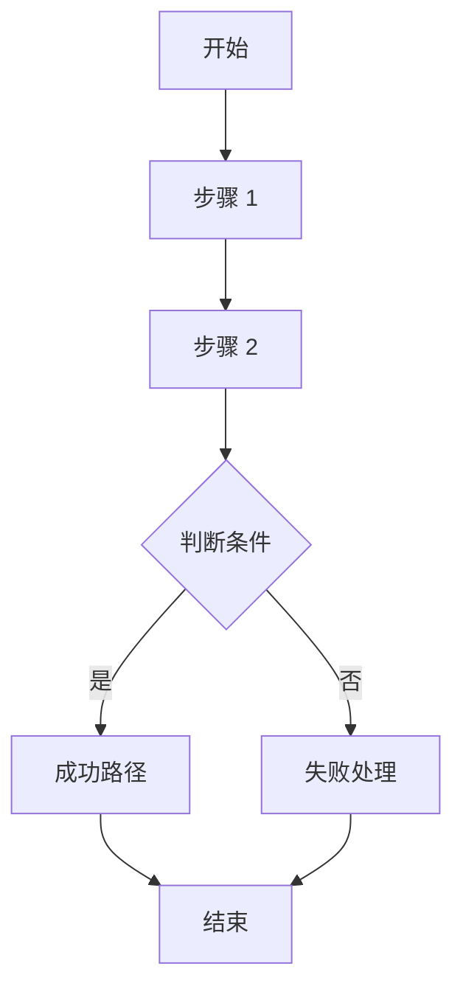
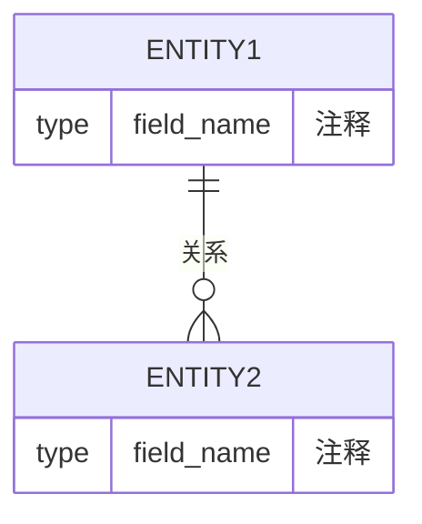

# PRD: [产品/功能名称]

---

## 📋 文档元数据

| 字段 | 值 |
|------|------|
| **文档 ID** | PRD-YYYY-XXX |
| **版本** | v1.0 |
| **作者** | [姓名] |
| **创建日期** | YYYY-MM-DD |
| **最后更新** | YYYY-MM-DD |
| **状态** | Draft / In Review / Approved / In Development / Shipped |
| **干系人** | [产品/研发/设计/测试负责人] |
| **保密级别** | 内部公开 / 机密 / 绝密 |

---

## 1. 问题陈述

### 1.1 核心问题
> 用 1-2 句话清晰描述要解决的用户痛点

**用户原话**（如有）：
> "..."

### 1.2 Why Now（紧迫性）
- [ ] 市场机会窗口
- [ ] 竞争压力
- [ ] 用户流失风险
- [ ] 业务增长瓶颈
- [ ] 技术债务累积
- [ ] 其他：_____

**如果不解决会怎样**：
[具体后果描述]

### 1.3 现有解决方案
| 方案类型 | 具体方案 | 缺点/局限 |
|----------|----------|-----------|
| 用户 workaround | | |
| 竞品方案 | | |
| 内部现有功能 | | |
| 维持现状 | | |

---

## 2. 目标与成功指标

### 2.1 业务目标
- [ ] [SMART 目标 1]
- [ ] [SMART 目标 2]

### 2.2 成功指标（KPI）

| 指标类型 | 指标名称 | 当前基线 | 目标值 | 测量方法 | 时间窗口 |
|----------|----------|----------|--------|----------|----------|
| 用户 engagement | DAU/MAU | | | | |
| 业务 | 转化率 | | | | |
| 业务 | 收入/成本 | | | | |
| 技术 | 性能 (P95/P99) | | | | |
| 技术 | 错误率 | | | | |
| 用户满意度 | NPS/CSAT | | | | |

### 2.3 非目标（Explicitly NOT doing）
- [ ] 明确说明本次不做的事情
- [ ] 防止范围蔓延

---

## 3. 用户与市场

### 3.1 目标用户画像

**主要用户**：
| 属性 | 描述 |
|------|------|
| 用户类型 | 消费者 / 企业用户 / 内部员工 / 开发者 |
| 年龄段 | |
| 使用场景 | |
| 核心需求 | |
| 痛点 | |

**次要用户**（如有）：
[描述]

### 3.2 用户故事

| ID | 用户角色 | 想要... | 以便... | 优先级 |
|----|----------|---------|---------|--------|
| US-001 | | | | P0/P1/P2 |
| US-002 | | | | P0/P1/P2 |

### 3.3 使用场景

**典型场景**（成功路径）：
1. [场景 1 描述]
2. [场景 2 描述]

**边缘场景**（失败/异常路径）：
1. [异常场景 1]
2. [异常场景 2]

### 3.4 竞争格局
| 竞品 | 优势 | 劣势 | 我们的差异化 |
|------|------|------|--------------|
| | | | |

---

## 4. 范围定义

### 4.1 In Scope（v1.0）

| 功能模块 | 功能描述 | 优先级 | 验收标准摘要 |
|----------|----------|--------|--------------|
| | | P0 | |
| | | P0 | |
| | | P1 | |

### 4.2 Out of Scope（本次不做）

| 功能 | 排除原因 | 可能 reconsider 的时间 |
|------|----------|----------------------|
| | | v2.0 / 待定 |

### 4.3 Future Considerations（v2.0+）
- [ ] 未来可能添加的功能
- [ ] 技术优化方向

---

## 5. 功能需求详情

### 5.1 功能：[功能名称]

**功能 ID**：FEAT-XXX

**优先级**：P0 / P1 / P2

**功能描述**：
[详细描述功能做什么]

**用户流程**：


**验收标准（Gherkin）**：
```gherkin
Feature: [功能名称]

Scenario: [成功场景]
  Given [前置条件]
  When [用户操作]
  Then [期望结果]

Scenario: [失败场景]
  Given [前置条件]
  When [用户操作]
  Then [期望的错误处理]

Scenario: [边界条件]
  Given [前置条件]
  When [边界值操作]
  Then [期望结果]
```

**UI/UX 要求**（如适用）：
- [ ] 界面布局描述
- [ ] 交互细节
- [ ] 响应式要求
- [ ] 无障碍要求

**数据要求**：
- [ ] 需要持久化的数据
- [ ] 缓存策略
- [ ] 数据保留策略

---

## 6. 数据结构设计

### 6.1 数据模型

**核心实体**：


### 6.2 数据字典

| 表名/实体 | 字段名 | 类型 | 必填 | 默认值 | 约束 | 说明 |
|-----------|--------|------|------|--------|------|------|
| users | id | BIGINT | ✓ | AUTO | PK | 用户 ID |
| users | email | VARCHAR(255) | ✓ | - | UNIQUE | 邮箱 |

### 6.3 数据变更影响
- [ ] 是否需要数据迁移
- [ ] 是否影响现有功能
- [ ] 是否需要向后兼容

---

## 7. API 契约

### 7.1 API 列表

| API ID | 端点 | 方法 | 描述 | 认证要求 |
|--------|------|------|------|----------|
| API-001 | /api/v1/resource | POST | 创建资源 | OAuth2 |

### 7.2 API 详情

#### API-001: [API 名称]

**请求**：
```yaml
POST /api/v1/resource
Headers:
  Authorization: Bearer <token>
  Content-Type: application/json
Body:
  {
    "field1": "type",
    "field2": "type"
  }
```

**响应（成功）**：
```yaml
HTTP 201 Created
Body:
  {
    "id": "resource_id",
    "created_at": "timestamp"
  }
```

**响应（错误）**：
```yaml
HTTP 400 Bad Request
Body:
  {
    "error_code": "INVALID_INPUT",
    "message": "详细描述",
    "field_errors": [...]
  }
```

**限流策略**：
- [ ] QPS 限制
- [ ] 配额管理

**版本策略**：
- [ ] 向后兼容要求
- [ ] 废弃时间表（如适用）

---

## 8. 非功能需求（NFR）

### 8.1 性能要求

| 指标 | 要求 | 测量条件 |
|------|------|----------|
| 响应时间 (P95) | < XXX ms | 正常负载 |
| 响应时间 (P99) | < XXX ms | 峰值负载 |
| 吞吐量 | XXX QPS | |
| 并发用户数 | XXX | |

### 8.2 可靠性要求
- [ ] 可用性目标：99.X%
- [ ] MTTR（平均恢复时间）：< X 分钟
- [ ] 数据持久性：99.XXXXX%
- [ ] 容灾要求：单 AZ / 多 AZ / 多 Region

### 8.3 安全要求
- [ ] 认证方式
- [ ] 授权模型（RBAC/ABAC）
- [ ] 数据加密（传输/存储）
- [ ] 敏感数据处理（脱敏/掩码）
- [ ] 审计日志要求
- [ ] 合规要求（GDPR/等保/HIPAA 等）

### 8.4 可维护性要求
- [ ] 日志规范（级别/格式/保留期）
- [ ] 监控指标（关键指标列表）
- [ ] 告警阈值
- [ ] 文档要求

### 8.5 可扩展性要求
- [ ] 水平扩展能力
- [ ] 预期增长曲线
- [ ] 扩容触发条件

---

## 9. 系统集成与依赖

### 9.1 内部依赖

| 依赖系统 | 接口/服务 | 用途 | SLA 要求 | 负责人 |
|----------|-----------|------|----------|--------|
| 用户中心 | OAuth API | 认证 | 99.9% | |
| 支付系统 | Payment API | 收款 | 99.95% | |

### 9.2 外部依赖

| 第三方服务 | 用途 | 备选方案 | 成本 |
|------------|------|----------|------|
| | | | |

### 9.3 集成点详细规格

**集成点 #1：[系统名称]**
- 协议：HTTP/gRPC/消息队列
- 超时设置：X 秒
- 重试策略：X 次，退避策略
- 降级方案：[描述]
- 数据一致性：最终一致/强一致

---

## 10. 风险评估与缓解

### 10.1 风险矩阵

| 风险 ID | 风险描述 | 可能性 | 影响 | 风险等级 | 缓解措施 | 负责人 |
|---------|----------|--------|------|----------|----------|--------|
| R-001 | | 高/中/低 | 高/中/低 | 🔴/🟡/🟢 | | |

### 10.2 Pre-mortem 分析

**假设项目失败了，可能的原因是**：

| 类别 | 潜在问题 | 预防措施 |
|------|----------|----------|
| 🐯 Tigers（真实威胁） | | |
| 📃 Paper Tigers（表面威胁） | | |
| 🐘 Elephants（大家回避的问题） | | |

### 10.3 应急预案
- [ ] 回滚方案
- [ ] 故障处理流程
- [ ] 沟通预案

---

## 11. 合规与法律

### 11.1 合规检查清单

| 合规项 | 是否适用 | 要求 | 状态 |
|--------|----------|------|------|
| GDPR（数据隐私） | 是/否 | | ✅/⬜ |
| 网络安全法 | 是/否 | | ✅/⬜ |
| 等保 2.0 | 是/否 | | ✅/⬜ |
| 行业特定合规 | 是/否 | | ✅/⬜ |

### 11.2 数据隐私影响评估（DPIA）
- [ ] 是否收集个人敏感信息
- [ ] 数据存储位置
- [ ] 数据共享方
- [ ] 用户权利（删除/导出/更正）

### 11.3 法务评审
- [ ] 用户协议更新
- [ ] 隐私政策更新
- [ ] 第三方协议

---

## 12. 时间线与里程碑

### 12.1 项目计划

| 阶段 | 开始日期 | 结束日期 | 交付物 | 负责人 |
|------|----------|----------|--------|--------|
| 需求评审 | | | PRD 定稿 | |
| 技术设计 | | | 架构文档 | |
| 开发 | | | 可运行代码 | |
| 测试 | | | 测试报告 | |
| 灰度发布 | | | 灰度报告 | |
| 全量发布 | | | 发布报告 | |

### 12.2 关键依赖时间线
| 依赖项 | 需要完成日期 | 依赖方 |
|--------|--------------|--------|
| | | |

### 12.3 发布计划
- [ ] 灰度策略（% 流量/特定用户群）
- [ ] 发布窗口（时间/日期）
- [ ] 发布检查清单
- [ ] 回滚触发条件

---

## 13. 变更管理

### 13.1 变更记录

| 版本 | 日期 | 变更内容 | 变更原因 | 申请人 | 批准人 |
|------|------|----------|----------|--------|--------|
| v1.0 | | 初始版本 | | | |

### 13.2 变更流程
1. 提交变更申请
2. 影响分析（研发/测试/产品）
3. CCB 评审（如适用）
4. 更新文档
5. 通知干系人

---

## 14. 开放问题

| 问题 ID | 问题描述 | 影响范围 | 负责人 | 目标解决日期 | 状态 |
|---------|----------|----------|--------|--------------|------|
| Q-001 | | | | | Open/Closed |

---

## 15. 附录

### 15.1 参考资料
- [文档/链接 1]
- [文档/链接 2]

### 15.2 术语表
| 术语 | 定义 |
|------|------|
| | |

### 15.3 相关文档
- [技术方案文档链接]
- [设计稿链接]
- [测试计划链接]

---

## ✅ PRD 评审检查清单

**产品评审**：
- [ ] 问题陈述清晰
- [ ] 成功指标可量化
- [ ] 范围定义明确
- [ ] 验收标准可测试

**技术评审**：
- [ ] 数据结构完整
- [ ] API 契约清晰
- [ ] 非功能需求明确
- [ ] 依赖关系梳理

**测试评审**：
- [ ] 验收标准可执行
- [ ] 测试场景覆盖
- [ ] 边界条件明确

**安全评审**：
- [ ] 安全需求定义
- [ ] 合规要求覆盖
- [ ] 风险评估完成

**干系人签字**：
| 角色 | 姓名 | 签字 | 日期 |
|------|------|------|------|
| 产品负责人 | | | |
| 技术负责人 | | | |
| 测试负责人 | | | |
| 安全负责人 | | | |

---

> 💡 **使用提示**：
> 1. 根据项目规模裁剪模板（MVP 可简化，大项目需完整）
> 2. 标记不适用的章节为 "N/A"
> 3. 所有 [占位符] 需要填写具体内容
> 4. 评审前确保检查清单全部完成
